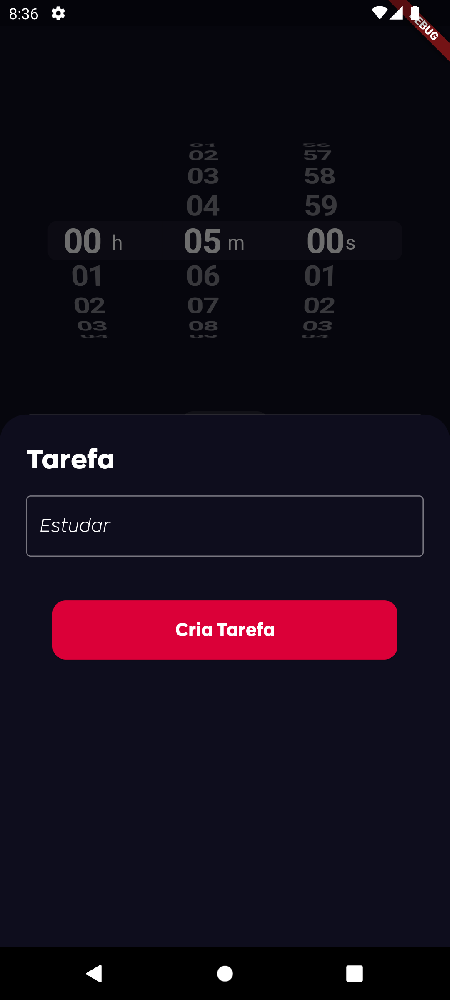
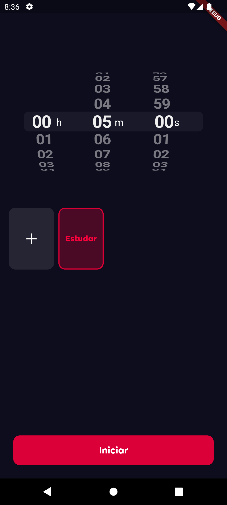
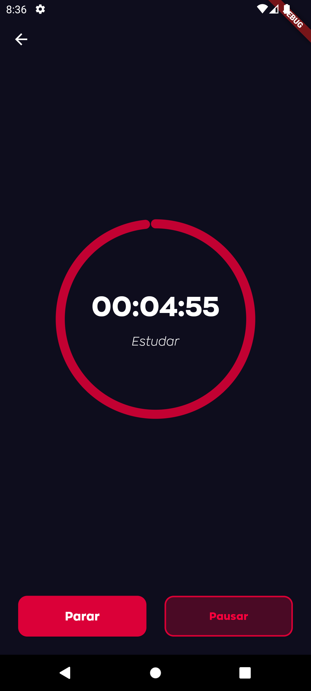
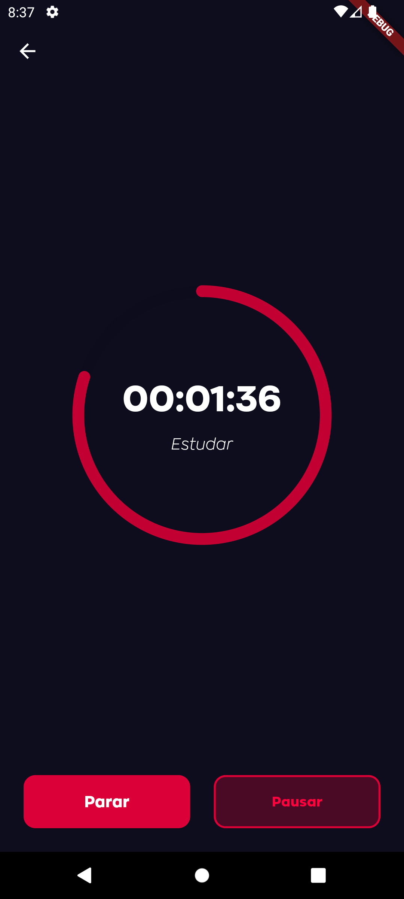

# Timer App

O **Timer App** é uma aplicação simples e intuitiva que permite criar tarefas e selecionar o tempo que você deseja dedicar a elas. É perfeito para melhorar a produtividade e gerenciar o tempo de maneira eficaz.

## Funcionalidades

- **Criação de Tarefas**: Adicione novas tarefas facilmente com um nome descritivo.
- **Seleção de Tempo**: Defina quanto tempo deseja dedicar a cada tarefa, com opções de personalização.
- **Funcionalidades Futuras**
  - **Gerenciamento de Tarefas**: Veja uma lista de todas as suas tarefas, com tempos definidos, e gerencie-as conforme necessário.
  - **Notificações**: Receba notificações quando o tempo da tarefa estiver prestes a terminar.

## Como Usar

1. **Adicionar Nova Tarefa**:
   ```plaintext
   - Clique no botão "+".
   - Insira o nome da tarefa.
   - Selecione o tempo desejado para dedicar a essa tarefa.
   - Clique em "Iniciar".
   ```

## Exemplo

```plaintext
- Tarefa: Estudar Matemática
- Tempo: 1 hora

Adicione a tarefa "Estudar Matemática" com um tempo de 1 hora, e o Timer App irá notificá-lo quando o tempo acabar,
ajudando você a manter o foco e a produtividade.
```

## Tecnologias Utilizadas

- **Flutter** e **Dart**
- **SharedPreferences**

UI expiration [Timer-App](https://dribbble.com/shots/17553953-Timer-App)

## Demo

<ul style="display: flex; flex-direction:row; gap: 12px; padding: 0;">
  
  
  
  
</ul>
